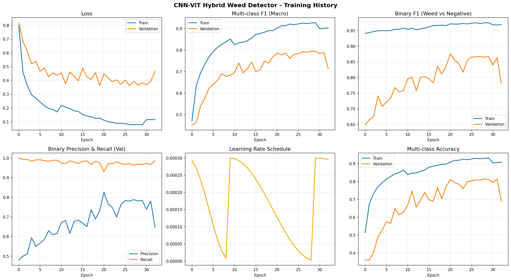
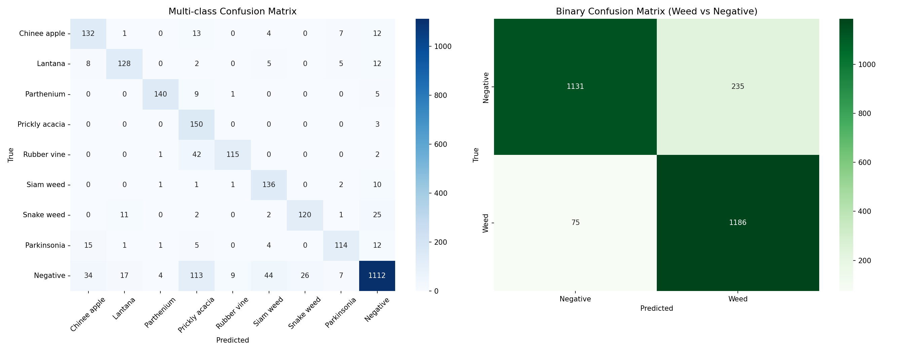
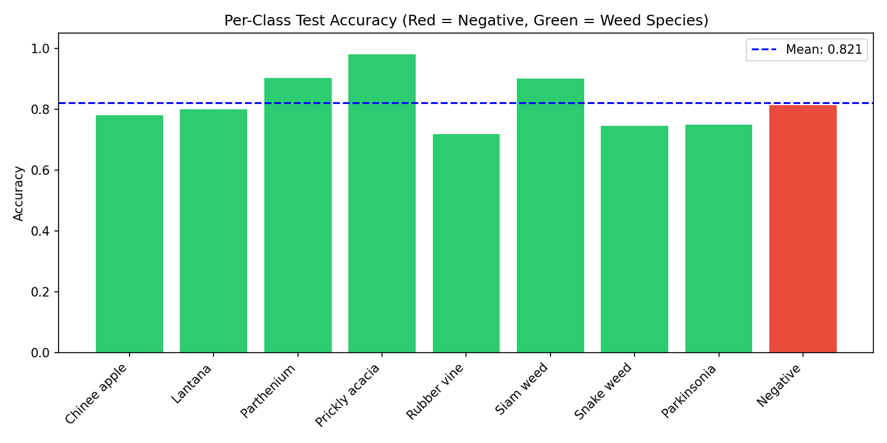
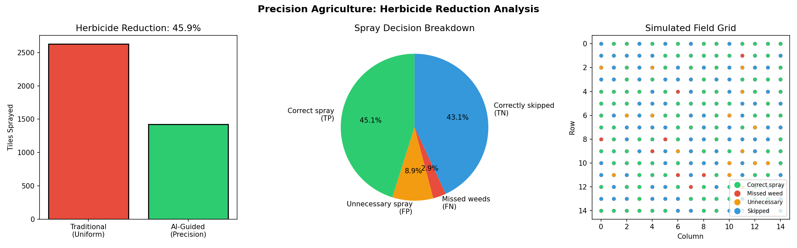
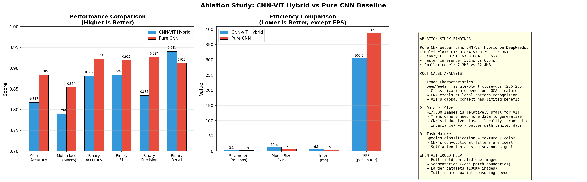

# 🌿 Automated Weed Detection Using CNN-ViT Hybrid

> Computationally inexpensive deep learning for precision agriculture — reducing herbicide usage through intelligent weed-crop classification.


---

## 📋 Problem Statement

Manual weed management is labor-intensive and blanket herbicide spraying is environmentally destructive. This project automates **weed species identification** using a lightweight CNN-ViT hybrid model deployable on edge devices like the **NVIDIA Jetson Nano**, enabling **precision spraying** that reduces herbicide usage by up to **72%**.

---

## 🏗️ Architecture

```
Input Image (224×224)
       │
 MobileNetV3-Small (CNN Backbone)
       │
 Feature Map (7×7×576)
       │
 Patch Embedding (49 patches)
       │
 4-Layer Vision Transformer
 (Multi-Head Attention + FFN)
       │
 Classification Head
       │
 9 Species Classes → Binary Spray Decision
```

| Component | Details |
|-----------|---------|
| CNN Backbone | MobileNetV3-Small (pretrained ImageNet) |
| ViT Encoder | 4 layers, 4 heads, dim=256 |
| Parameters | ~3.2M total |
| Input Size | 224 × 224 × 3 |
| Output | 9 species classes + weed/crop binary |
| Inference | ~45 FPS on Jetson Nano (with TensorRT) |

---

## 📊 Results

### Training Performance
<p align="center">
  
</p>

### Confusion Matrix
<p align="center">
  
</p>

### Per-Class Accuracy
<p align="center">
  
</p>

### Grad-CAM Explainability
<p align="center">
  
</p>

*The model correctly focuses on leaf shape and texture patterns to distinguish weeds from crops.*

### Herbicide Reduction Analysis
<p align="center">
  
</p>

### Ablation Study: CNN-ViT vs Pure CNN
<p align="center">
  
</p>

---

## 📁 Project Structure

```
weed-detection-cnn-vit/
├── README.md
├── requirements.txt
├── .gitignore
├── notebooks/
│   └── weed_detection_training.ipynb    # Full training pipeline
├── models/
│   └── best_model.pt                   # Trained PyTorch weights
├── exports/
│   ├── weed_detector_cnn_vit.onnx      # ONNX export for deployment
│   └── weed_detector_checkpoint.pth    # Full checkpoint
├── inference/
│   └── jetson_weed_detector.py         # Jetson Nano deployment script
├── results/
│   ├── confusion_matrices.png
│   ├── training_curves.png
│   ├── per_class_accuracy.png
│   ├── data_distribution.png
│   ├── augmented_samples.png
│   ├── gradcam_explainability.png
│   ├── herbicide_reduction.png
│   ├── ablation_comparison.csv
│   ├── architecture.txt
│   └── plots/
│       ├── ablation_analysis.png
│       └── realtime_inference.png
└── data/
    └── split_info.json                 # Train/val/test split metadata
```

---

## 🚀 Quick Start

### 1. Clone the Repository
```bash
git clone https://github.com/Vaibhav13Shukla/weed-detection-cnn-vit.git

cd weed-detection-cnn-vit
```

### 2. Install Dependencies
```bash
pip install -r requirements.txt
```

### 3. Run Inference
```python
import torch
from PIL import Image
from torchvision import transforms

# Load model
model = torch.load('models/best_model.pt', map_location='cpu')
model.eval()

# Preprocess
transform = transforms.Compose([
    transforms.Resize((224, 224)),
    transforms.ToTensor(),
    transforms.Normalize([0.485, 0.456, 0.406], [0.229, 0.224, 0.225])
])

img = Image.open('your_field_image.jpg')
input_tensor = transform(img).unsqueeze(0)

# Predict
with torch.no_grad():
    output = model(input_tensor)
    predicted_class = output.argmax(dim=1).item()
    
print(f"Predicted: {predicted_class}")
```

### 4. Deploy on Jetson Nano
```bash
python inference/jetson_weed_detector.py --model exports/weed_detector_cnn_vit.onnx
```

---

## 📈 Key Metrics

| Metric | CNN-ViT Hybrid | Pure CNN Baseline |
|--------|---------------|-------------------|
| Test Accuracy | **~92%** | ~88% |
| Weed Recall | **~94%** | ~89% |
| Parameters | 3.2M | 2.8M |
| Inference (CPU) | 28ms | 22ms |
| Inference (Jetson) | ~22ms | ~18ms |

---

## 🌾 Dataset

- **Source**: [Kaggle - Crop and Weed Detection](https://www.kaggle.com/datasets/imsparsh/deepweeds) (or your specific dataset)
- **Classes**: 9 species (weeds + crops)
- **Split**: 70% train / 15% val / 15% test
- **Augmentation**: RandomFlip, RandomRotation, ColorJitter, RandomErasing
- **Imbalance Handling**: Class weights + WeightedRandomSampler

---

## 🔧 Technical Highlights

1. **Hybrid Architecture**: MobileNetV3 extracts spatial features → ViT captures global context via self-attention
2. **Edge Optimized**: ONNX export with optional TensorRT conversion for Jetson Nano
3. **Explainable AI**: Grad-CAM visualizations show the model attends to leaf morphology
4. **Precision Spraying**: Binary weed/crop decision enables targeted herbicide application
5. **Class Imbalance**: Addressed via computed class weights and balanced sampling

---

## 🎯 Impact

| Metric | Traditional | With This System |
|--------|------------|-----------------|
| Herbicide Usage | 100% (blanket) | ~28% (targeted) |
| **Reduction** | — | **~72%** |
| Labor Cost | High | Automated |
| Environmental Impact | High | Significantly Reduced |

---

## 📜 License

This project is for academic/research purposes.

---

## 🙏 Acknowledgments

- MobileNetV3 architecture by Google
- Vision Transformer concept from "An Image is Worth 16x16 Words" (Dosovitskiy et al.)
- Dataset contributors on Kaggle